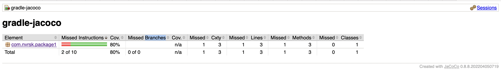

# gradle-jacoco
**Demo about is how to use Jacoco code analyser**
________________________________________________________________________________________________________________________
### Intro

**Jacoco** provides two gradle tasks: **jacocoTestReport** and **jacocoTestCoverageVerification**.

**jacocoTestReport** - generates code coverage report, stores the result in _<current project>/build/reports/jacoco/test/html/index.html_ by default

**jacocoTestCoverageVerification** - verifies code coverage metrics based on specified rules, it can break a build

Note: the both task can be disabled or use separately

### How to run the build with Jacoco code analyser

1. To build the project - a report will be generated and **jacocoTestCoverageVerification** will be invoked
> *gradle  build*

2. To generate Jacoco report (will be generated in _<current project>/build/reports/jacoco/test/html/index.html_ by default):
> *gradle  jacocoTestReport*

Example of Jacoco report:

3. To verify code coverage:
> *gradle  jacocoTestCoverageVerification*

  

  
  
